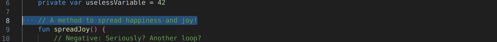
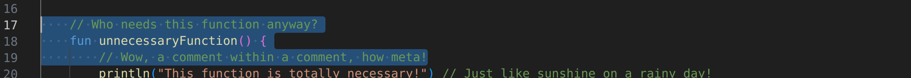

# Case study

We show some cases of the sentiment analysis examples and outputs here.


### Simple case 

At line 8 in `SetimentAnalysis.kt`, there is a highly positive comment. 



The prediction made by the plugin is:

> - ```kotlin
>   // A method to spread happiness and joy!
>   ```
>   Sentiment Analysis Result: **positive** :smile:

We can see the comment is successfully extracted and result is positive.

Also from line 17 - 19, there are two semantically negative comments.



The corresponding predictions are both negative:

> - ```kotlin
>   // Who needs this function anyway?
>   ```
>   Sentiment Analysis Result: **negative** :weary:
>
>
>
> - ```kotlin
>   // Wow, a comment within a comment, how meta!
>   ```
>   Sentiment Analysis Result: **negative** :weary:


### Multiple Lines Comment

From line 26 to 39, there is a multi-line comment:


And the extracted comment and sentiment result is:

> - ```kotlin
>   /*
>   * Don't even bother reading this code, it's a waste of time.
>   * This function is like a black hole of coding futility.
>   */
>   ```
>   Sentiment Analysis Result: **negative** :weary:


