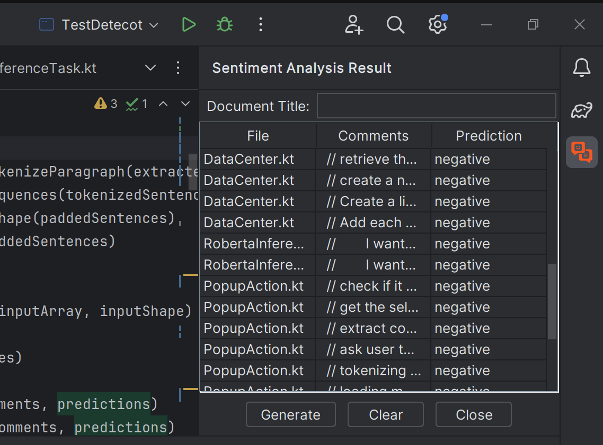

#  Sentiment Analysis Plugin

# Sentiment Analysis Plugin  

<!-- Plugin description -->

### Overview:

The **Sentiment Analysis Plugin** for IntelliJ is a powerful tool designed to enhance your coding experience by providing real-time sentiment analysis on Kotlin code snippets within the IntelliJ IDEA IDE. This intelligent plugin leverages the robust Roberta Sequence Classification Model to analyze the emotional tone of your comments, helping you understand and improve the overall sentiment of your programming.


### Key Features

- **Right-Click Functionality**: Users can simply right-click on a file or selected code snippet to trigger the sentiment analysis. 
- **Dedicated Tool Window**: The plugin introduces a dedicated tool window for users to conveniently view sentiment analysis outputs.
- **Markdown Output**:The plugin can create a markdown file that compiles all sentiment analysis outputs, offering a convenient way to document and analyze the emotional dynamics of comments.

<!-- Plugin description end -->


### Table of contents

We introduce the following contents in this README.

- [Requirements](#requirements)
- [User Manual](#user-manual)
  - [Resources](#resources)
  - [PopupAction](#popupaction)
  - [Tool Window](#tool-window)
  - [Outputs](#outputs)
- [Code Analysis](#code-analysis)
  - [Project structure](#project-structure)
  - [Actions](#actions)
  - [Settings](#settings)
  - [Pre-Processing](#pre-processing)
  - [Inference](#inference)
  - [Post-processing](#postprocessing)
  - [DataCenter](#datacenter)
  - [Window](#window)
  - [Writer](#writer)


## Task Requirments

 - [x] The plugin has been developed using both Java and Kotlin. Specifically, Java was employed for implementing functionalities such as `commentDetection`, `tokenize`, `window`, `windowFactory`, and `writer`, while Kotlin was used for the rest functionalities.
 - [x] The plugin is built via the IntelliJ Platform Plugin Template;
 - [x] The model is inferred from the plugin code with the KInference library;
 - [x] The plugin uses the RoBERTa model;
 - [x] The plugin uses the provided [tokenizer](https://github.com/purecloudlabs/roberta-tokenizer/tree/main);
 - [x] The code is covered with tests;
 - [x] The **model inference** operation is run under the `import com.intellij.openapi.progress.ProgressManager` as a background task `Task.Backgroundable`.  The **output writing** action is done through the `Application.runWriteAction()` API;
 - [x] This repository contains a built plugin, a test project and a README file as user manual;
 - [x] The plugin works with Intellij IDEA 2023.2.3 or higher;
 - [x] The solution is provided via a GitHub link;


## User Manual

We will cover the resources, UI components, including PopupAction, tool window, and the output process of the Sentiment Analysis Plugin. You can follow this [tutorial](https://www.jetbrains.com/help/idea/managing-plugins.html#install_plugin_from_disk) to install this plugin from `.jar`. 

#### Resources

To begin, make sure to download the Roberta model and the associated tokenizer resources. When you run the plugin for the first time, it will prompt you to select a folder and file for these resources. The chosen path will be saved and remembered by the plugin unless the local resources are deleted or renamed. In such cases, the plugin will request the user to specify the resources again.

If the user decide not to choose the resources file, the plugin will stay silence until the user runs the plugin again.

You can find the necessary tokenizer resources in this repository at the following link: https://github.com/com3dian/Sentiment_Analysis_plugin/tree/main/Roberta-resources/roberta-tokenizer. The tokenizer resources are sourced from https://huggingface.co/roberta-base/tree/main, and the Roberta model is obtained from https://github.com/onnx/models/tree/main/validated/text/machine_comprehension/roberta.

#### PopupAction

The Sentiment Analysis plugin supports conducting sentiment analysis on opened Kotlin files within Intellij IDEA. To initiate the plugin, open a Kotlin source code file (`.kt` or `.kts`), select specific text, right-click on it, and find the sentiment analysis action at the top of the context menu. Clicking the <kbd>sentiment analysis</kbd> button will trigger the backend inference. If you wish to analyze the entire file, simply run the plugin without making a selection, and it will automatically analyze the entire file.

![right click][file:right-click]

In the inference phase, the plugin parses the file, extracting all comments while removing the comment markers `//`, `/*`, `*/`, and line breaks (`\n`). It's important to note that the sentiment analysis component guarantees accurate comment extraction only for Kotlin files that are free of grammar errors. If the current file is not a Kotlin file, the plugin will not execute and will instead open an information window indicating that the file is not Kotlin.

![file not kotlin][file:file-not-kotlin]

The comments are then tokenized and input into the Roberta model, with the model's outputs automatically stored in the plugin's data center. During the inference process, you can find the <kbd>Running Roberta Inference</kbd> hint in the bottom bar.

![running roberta inference][file:running-roberta-inference]

You can click the <kbd>Sentiment analysis</kbd> button multiple times, and all results will be collectively stored. To view the results, you can open the tool window component.

#### Tool window

The tool window is positioned in the top right corner by default. Clicking the <kbd> icon </kbd> opens the view panel. Initially, both the <kbd>Document title</kbd> and the results table are empty. When you run the sentiment analysis plugin by right-clicking, the table dynamically retrieves outputs data from the data center and updates the output accordingly.

![tool window][file:tool-window]

In the output table, the 'File' column contains the extracted file names, the 'Comment' column stores the original comments, and the 'Prediction' column displays the sentiment analysis result as either positive or negative. Clicking the <kbd>Clear</kbd> button removes all results, while clicking the <kbd>Close</kbd> button shuts the tool window without deleting the data.



To generate an output file containing all results, you must provide a <kbd>Document Title</kbd> in the designated input field; this title will also serve as the output file name. If no document title is provided, the plugin  will prompt an information window displaying the message 'Document title can not be empty.'

![no title][file:no-title]

Conversely, when a document title is set, the plugin will prompt a file chooser window for selecting the destination to save the `results.md` file.

![output chooser][file:output-chooser]

Note that if no results are available, the plugin cannot generate the output Markdown file. Instead, it will display an information window stating, 'Empty output cannot be exported. Please run the sentiment analysis plugin first.''

![no output][file:no-output]

#### Outputs

The sentiment analysis result will be stored in a markdown file. A typical format of the output is:

> # Given Document Title
>
> ## FirstFile.kt
>
> - ```kotlin
>   // first comment ...
>   ```
>   Sentiment Analysis Result: **negative** :weary:
>
> - ```kotlin
>   // second comment ... 
>   ```
>   Sentiment Analysis Result: **negative** :weary:
>   
> - ```kotlin
>   // ...
>   ```
>
> ## SecondFile.kt
>
> - ```kotlin
>   // first comment ...
>   ```
>   Sentiment Analysis Result: **negative** :weary:
>

Comments extracted from the same file will be displayed together,  regardless of whether they were extracted in the same action (right-click).


## Code Analysis

This section provides a comprehensive overview of the plugin's source code, offering insights into its structure, functionalities, and key components. The following topics delve into different aspects of the codebase, providing valuable information on how each component contributes to the overall functionality.


#### Project Structure

In this section we explore the organization of files and directories, gaining insights into the layout of the plugin's codebase. Here is a flow map of the plugin's work flow. The details of functionalties for each component will be introduced in the following sections.

![project structure][file:project-structure]


#### Actions

The `PopupAction` class in the provided code is an implementation of the `AnAction` class in IntelliJ IDEA. It represents the core functionality of the plugin related to sentiment analysis on Kotlin code.

1. **Triggering Action:**

   The `PopupAction` is triggered when the user performs an action in the IDE (e.g., right-clicking or using a shortcut).

2. **File Type Check:**

   It first checks whether the currently opened file is a Kotlin file. If not, it displays a message informing the user that sentiment analysis can only be performed on Kotlin files.

3. **Text Selection:**

   It retrieves the selected text from the editor. If no text is selected, it considers the entire content of the file.

4. **Comment Extraction:**

   Utilizes the `Detector` class to extract comments from the selected Kotlin code.

5. **Tokenizer Initialization:**

   Asks the user to provide the path to the tokenizer. If the path is incorrect or missing, it prompts the user to re-select the directory.

6. **Tokenization and Preprocessing:**

   Tokenizes and preprocesses the extracted comments using the provided `TokenizerRunner`.

7. **Model Loading and Inference:**

   Loads the Roberta model for sentiment analysis using the provided path. If the model files are incorrect or missing, it prompts the user to re-select the directory.

   Performs sentiment analysis in background using the loaded model through the `RobertaInference` class.

8. **Progress Tracking:**

   Runs the inference in the background with a progress indicator to provide user feedback.

9. **Data Update:**

   Updates the data center with the results of sentiment analysis.


#### Settings

The `PluginState` class in the provided code is a simple Kotlin class responsible for managing the state of the plugin settings. It uses the IntelliJ IDEA's `PropertiesComponent` to store and retrieve key-value pairs persistently.

1. **PropertiesComponent Initialization:**

   The class initializes the `PropertiesComponent` instance, which is used for storing and retrieving key-value pairs persistently across IDE sessions.

2. **Model Path and Tokenizer Path Properties:**

   It defines two properties, `modelPath` and `tokenizerPath`, which correspond to the paths of the sentiment analysis model and tokenizer resources, respectively.

   The `get` and `set` accessors use the `PropertiesComponent` to get and set the values associated with these keys.

3. **Initialization Method (`init`):**

   The `init` method is intended for performing any initialization tasks. In this case, it sets default values for `modelPath` and `tokenizerPath` if they are empty.


#### Pre-Processing

The `Detector` class in the provided code is responsible for extracting comments from Kotlin code, handling newlines, and processing text.

1. **Text Processing:**

   The `processText` method takes an input text and replaces line breaks or comment symbols with spaces. It then condenses multiple spaces into one space.

2. **Indentation Removal:**

   The `removeIndentation` method removes leading whitespaces from each line in Kotlin code to eliminate indentation.

3. **String Location Check:**

   The `checkString` method checks if a given position (start, end) falls within the range of any string literals in the Kotlin code.

4. **String Location Extraction:**

   The `getAllStrings` method extracts the locations (start, end) of all string literals in the Kotlin code.

5. **Comment Extraction:**

   The `extractCommentsFromKotlinCode` method uses a regular expression to match Kotlin block comments (`/* ... */`) and blocks of single-line comments (`// ... \n// .. `).

   It handles the removal of indentation and checks for string literals using the `checkString` method.

   Optionally, it processes the extracted comments by invoking the `processText` method.

6. **Newline Handling:**

   The `handleNewlines` method removes leading and trailing newlines from a given input and replaces internal newlines with an indented format.

7. **Main Method (Example Usage):**

   The `main` method provides an example of using the various functionalities of the `Detector` class on a sample Kotlin code.


The `TokenizerRunner` class in the provided code is  responsible for tokenizing sentences and paragraphs using the Roberta  tokenizer, as well as padding and flattening sequences of tokens.

1. **Initialization:**

   The class is initialized with a path to the vocabulary base directory, creating a `RobertaTokenizer` instance.

2. **Tokenization:**

   `tokenizeSentence(String sentence)`: Tokenizes a single sentence using the Roberta tokenizer and returns the resulting token IDs as a `long` array.

   `tokenizeParagraph(ArrayList<String> paragraph)`: Tokenizes a list of sentences, returning a list of tokenized sentences (each represented as a `long` array).

3. **Padding Sequences:**

   `padSequences(ArrayList<long[]> sequences)`: Pads a list of tokenized sentences to the same length by adding padding tokens (token 1).

4. **Shape Calculation:**

   `getPaddedShape(ArrayList<long[]> paddedSentences)`: Calculates the shape of a list of padded tokenized sentences, represented as a `long` array `[numSentences, maxLength]`.

5. **Flattening Sequences:**

   `flatten(ArrayList<long[]> nestedList)`: Flattens a nested list of tokenized sentences into a single `long` array.

6. **Example Usage (in `main` method):**

   Initializes a `TokenizerRunner` with a vocabulary base directory path.

   Tokenizes and pads a list of example sentences, then prints the resulting tokenized and padded sentences, the flattened array, and the shape.


#### Inference

The `RobertaInference` class in the provided code is responsible for performing inference using the given ORT (ONNX Runtime) model.

1. **Initialization:**

   The class is initialized with an instance of `ORTModel`, representing the Roberta model for sentiment analysis.

2. **Prediction Method:**

   `suspend fun predict(array: LongArray, shape: LongArray): FloatArray`: Takes a tokenized and shaped input as a `LongArray` and a corresponding shape as a `LongArray`.

   Creates an `ORTTensor` from the input array and shape.

   Calls the `predict` method of the `ORTModel` with the input tensor.

   Closes the `ORTModel` after making predictions to release resources.

   Retrieves the output tensor (`"output"`) from the prediction result.

   Converts the output tensor to a `FloatArray` and returns it.


#### Post-processing

The `postProcessing` function in the provided code performs post-processing on the output of the sentiment analysis model.

1. **Input Validation:**

   Checks if the input `floatArray` is not null and not empty. If it's empty, it returns `null`.

2. **Array Length Validation:**

   Ensures that the length of the input array is even (2N). Throws an exception if the length is not even.

3. **Sentiment Classification:**

   Divides the input array into pairs of values.

   For each pair, compares the values at even and odd indices.

   If the value at the even index is greater than the value at the odd index, assigns "negative"; otherwise, assigns "positive".

   Constructs and returns an array of strings representing the predicted sentiment for each pair.

4. **Handling Null Input:**

   If the input `floatArray` is null, the function returns `null`.


#### DataCenter

The `DataCenter` class in the provided code is a singleton  class responsible for managing and storing data related to the Sentiment Analysis plugin.

1. **Data Fields:**

   `selectedComment`: String representing the currently selected comment.

   `fileName`: String representing the name of the file being processed.

   `fileType`: String representing the type of the file being processed.

2. **Outputs Map:**

   `outputsMap`: Mutable map storing sentiment analysis results. The keys are file names, and the values are lists of pairs containing comments and predictions.

3. **Table Model:**

   `tableModel`: Default table model for displaying data in a table.

4. **Singleton Pattern:**

   Uses the Singleton pattern to ensure only one instance of the `DataCenter` class is created.

5. **Instance Creation:**

   The `getInstance` method is used to access the singleton instance or create a new one if it doesn't exist.

6. **Markdown Document Generation:**

   `getContent(title: String)`: Generates a Markdown document with specified title, including file-wise sentiment analysis results.

7. **Reset Method:**

   `reset()`: Clears the `outputsMap` and resets the table model.

8. **Adding Data:**

   `addToMap`: Adds sentiment analysis results to the `outputsMap`.

   `addToTable`: Adds sentiment analysis results to the table model.

9. **Show Method:**

   `show()`: Prints the contents of the `outputsMap` for debugging purposes.


#### Window

The `OutputWindow` class appears to be a graphical user  interface (GUI) component designed for the Sentiment Analysis plugin. It provides a tool window within the IntelliJ IDEA environment, allowing  users to interact with sentiment analysis results.

1. **Components:**

   `content`: The main panel containing various UI components.

   `contentTable`: A table for displaying sentiment analysis results.

   `generateButton`: Button to generate a Markdown document from the sentiment analysis results.

   `clearButton`: Button to clear the displayed results.

   `closeButton`: Button to close the tool window.

2. **UI Layout:**

   The GUI layout includes a title label, document input panel, table panel, and buttons panel.

3. **Initialization:**

   The `createUIComponents` method initializes the GUI components and sets up the layout.

4. **Listeners:**

   The `setupListeners` method sets up listeners for the "Generate," "Clear," and "Close" buttons.

   The "Generate" button triggers the generation of a Markdown document based on sentiment analysis results.

   The "Clear" button resets the sentiment analysis results.

   The "Close" button hides the tool window.

5. **File Generation:**

   The "Generate" button prompts the user to choose an output folder and then calls the `writeFile` method from the `OutputsWriter` class to perform the file write operation.

6. **Validation:**

   Checks whether the sentiment analysis results are empty before attempting to export.

7. **Document Title:**

   Allows the user to input a document title.


#### Writer

The `OutputsWriter` class provides functionality for writing content to an output file. It uses the IntelliJ Platform's `WriteCommandAction` to perform write operations within a write action, ensuring proper handling within the IDE environment.

1. **Write File**

   Checks if a file exists and displays a message accordingly. If the file doesn't exist, it creates the file, writes content to it, and shows a  success message.

1. **Create File**

   Creates a `File` object within a write command action.

1. **Write Content To File**

   Writes content to the specified file using a `FileWriter`.

1. **Error Handling:**

   Handles `IOException` by printing an error message.


[file:right-click]: ./.github/readme/right-click.png
[file:file-not-kotlin]: ./.github/readme/file-not-kotlin.png
[file:running-roberta-inference]: ./.github/readme/running-roberta-inference.png
[file:tool-window]: ./.github/readme/tool-window.png
[file:tool-window-table]: ./.github/readme/tool-window-table.png
[file:no-title]: ./.github/readme/no-title.png
[file:output-chooser]: ./.github/readme/output-chooser.png
[file:no-output]: ./.github/readme/no-output.png
[file:project-structure]: ./.github/readme/project-structure.svg
